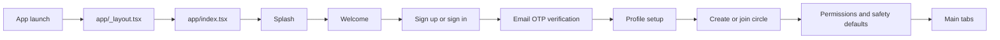
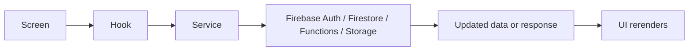
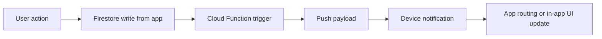

# SOSync Project Guide

If you are brand new to the project, start here before digging into individual files.

## 1. What SOSync Is

SOSync is a disaster-awareness and emergency-coordination mobile app built with Expo Router, React Native, Firebase, and Cloud Functions.

In simple terms, the app lets a user:

- create an account
- verify their email with a one-time code
- set up a profile
- create or join a trusted circle
- share location with that circle
- view alerts and evacuation-related information
- send an SOS event to the circle
- receive notifications about alerts and SOS activity

### Current reality

These points are important because they affect how you should understand the project:

- Android is the main platform being validated right now.
- Live Firebase is the default development path.
- Emulator mode exists, but it is optional and explicit.
- Demo mode exists, but it is also explicit and not the normal app path.
- iOS code exists, but iOS remote push is not finished because APNs is not configured.
- The generated `ios/` native folder was intentionally removed and is currently not the source of truth.
- Notification payloads include a possible `message` type, but a full messaging/chat feature is not implemented end-to-end.
- The project is a strong working foundation, but it is not yet a fully finished production app.

## 2. Tech Stack

SOSync is split into two main workspaces.

### App workspace

This is the mobile app that users interact with.

- Framework: Expo + React Native
- Navigation: Expo Router
- Styling: NativeWind utility classes plus shared design tokens
- State style: React hooks and a central session provider
- Backend client services: Firebase Auth, Firestore, Functions, Messaging, Storage
- Device features: location, notifications, image picking, maps

### Backend workspace

This is the Firebase Cloud Functions code under `functions/`.

- Runtime: Firebase Cloud Functions v2
- Language: TypeScript
- Admin SDK: `firebase-admin`
- Main jobs:
  - create and join circles
  - verify email OTP codes
  - proxy evacuation route requests
  - sync disaster alerts
  - fan out Android push notifications for alerts and SOS events

## 3. Folder Structure

Below is a trimmed tree of the main folders that matter most.

```text
SOSync/
├── app/                  Expo Router route files
│   ├── (onboarding)/     Onboarding routes
│   ├── (tabs)/           Main signed-in tab routes
│   ├── account/          Account/settings routes
│   ├── alerts/           Alert detail routes
│   └── ...
├── assets/               Images, icons, branding, onboarding art
├── docs/                 Project docs and status docs
├── functions/
│   ├── src/              Cloud Functions source code
│   ├── scripts/          Backend helper scripts
│   └── lib/              Compiled output
├── scripts/              Local setup and Android QA helper scripts
├── src/
│   ├── components/       Reusable UI pieces
│   ├── config/           Runtime/env/app configuration
│   ├── hooks/            Screen-facing custom hooks
│   ├── modules/          Feature-based screen implementations
│   ├── providers/        App-wide context providers
│   ├── services/         Firebase, API, notifications, media, location
│   ├── types/            Shared app data types
│   └── utils/            Validators and helper functions
├── tests/                Rules and helper tests
├── firestore.rules       Firestore security rules
└── firestore.indexes.json
```

### Important note about `app/`

Many files inside `app/` are very small route wrappers.

Example:

- `app/(tabs)/home.tsx` does not contain the whole Home screen UI.
- It just re-exports the real screen from `src/modules/map/screens/HomeMapScreen.tsx`.

That means:

- `app/` tells you the route structure
- `src/modules/**/screens` contains most of the real screen logic

## 4. How Navigation Works

Navigation is handled with Expo Router.

### Main navigation files

- `app/_layout.tsx`
  - boots the app
  - wraps everything with providers
  - runs app bootstrap hooks
- `app/index.tsx`
  - acts like the entry traffic controller
  - decides whether the user should go to onboarding, verification, or the main tabs
- `app/(onboarding)/_layout.tsx`
  - groups onboarding screens together
  - keeps fully onboarded users out of setup routes
- `app/(tabs)/_layout.tsx`
  - defines the main five-tab app shell
- `src/utils/sessionRouting.ts`
  - decides which onboarding step a signed-in user should resume

### Main app flow



### Main tabs

The app currently uses a five-tab layout:

- Home
- Hotlines
- SOS
- Alerts
- Profile

This is defined in `app/(tabs)/_layout.tsx` and rendered with the custom tab component in `src/components/PrototypeTabBar.tsx`.

## 5. How The App Is Organized

SOSync uses a layered structure. This makes the code easier to reason about once you know what each layer is supposed to do.

### 1. Routes

Location: `app/`

Job:

- define URL-like app routes
- connect route names to screens
- organize onboarding, tabs, and settings paths

Think of this layer as the map of the app.

### 2. Screens

Location: `src/modules/**/screens`

Job:

- build each page the user sees
- call hooks
- connect UI to app actions

Examples:

- `src/modules/map/screens/HomeMapScreen.tsx`
- `src/modules/sos/screens/SosScreen.tsx`
- `src/modules/notifications/screens/NotificationsScreen.tsx`

Think of this layer as the user-facing pages.

### 3. Reusable components

Location: `src/components/`

Job:

- provide reusable building blocks like buttons, rows, wrappers, inputs, and cards
- keep screens from repeating the same UI patterns

Examples:

- `Screen`
- `Button`
- `SettingsRow`
- `CodeInput`
- `PrototypeTabBar`

### 4. Hooks

Location: `src/hooks/`

Job:

- prepare data for screens
- subscribe to Firestore
- combine multiple services into simpler screen-friendly outputs

Examples:

- `useLocation`
- `useNotifications`
- `useAlerts`
- `useGroupMembers`

Think of hooks as the bridge between raw data/services and screen UI.

### 5. Services

Location: `src/services/`

Job:

- talk to Firebase and external backend endpoints
- wrap device APIs like location, notifications, and image picker
- hide low-level API details from screens

Examples:

- `authService`
- `firestoreService`
- `circleService`
- `notificationService`
- `apiService`
- `profileMediaService`

### 6. Providers

Location: `src/providers/`

Job:

- hold app-wide state and actions
- share common state across the app

Most important file:

- `src/providers/SessionProvider.tsx`

This is the central coordinator of the app. It manages:

- auth state
- current user profile
- user groups
- selected active group
- onboarding completion logic
- major session actions like sign in, sign up, save profile, create circle, join circle, leave circle, and sign out

### 7. Types, config, and utils

Locations:

- `src/types/`
- `src/config/`
- `src/utils/`

Jobs:

- define shared data shapes
- define runtime modes and env values
- store helpers and validation logic

### 8. Cloud Functions

Location: `functions/src/`

Job:

- perform secure backend work that should not happen directly in the client
- keep secrets off-device
- react to Firestore events

## 6. Major Features And How They Work

### Onboarding and Auth

Main files:

- `src/modules/onboarding/screens/*`
- `src/services/authService.ts`
- `src/providers/SessionProvider.tsx`
- `functions/src/emailVerification.ts`

How it works:

1. The user signs up with email, password, name, and phone number.
2. `authService` creates the Firebase Auth account.
3. The app saves profile data into Firestore under `users/{uid}`.
4. The app requests an email OTP through the callable function `sendEmailOtp`.
5. The backend stores hashed OTP state in `email_verifications/{uid}`.
6. The user enters the code.
7. The callable function `verifyEmailOtp` checks the code and marks the Firebase Auth email as verified.
8. The app continues to profile setup, circle setup, and permissions.

Important detail:

- onboarding progress is stored on the user profile in Firestore, so the app can resume at the correct step later

### Home Map

Main files:

- `src/modules/map/screens/HomeMapScreen.tsx`
- `src/hooks/useLocation.ts`
- `src/hooks/useAlerts.ts`
- `src/hooks/useGroupMembers.ts`
- `src/hooks/useGroupPreferences.ts`
- `src/services/firestoreService.ts`
- `src/services/apiService.ts`

What the Home screen uses:

- active circle
- current user profile
- current location
- group members
- shared member locations
- alerts
- evacuation centers
- route summary from the backend

How it works:

- the app gets the current user location through `expo-location`
- if live sharing is enabled, `useLocation` writes the location into Firestore
- the app listens to other group members' locations from the `locations` collection
- the app listens to alerts from the `alerts` collection
- the app loads evacuation centers
- when a route is requested, the app calls the backend HTTP endpoint `getEvacuationRoute`

Web note:

- the real native map is not used on web
- `MapOverview.web.tsx` shows a fallback placeholder instead

### SOS

Main files:

- `src/modules/sos/screens/SosScreen.tsx`
- `src/services/firestoreService.ts`
- `functions/src/notifications.ts`

How it works:

1. The user opens the SOS tab.
2. A countdown starts before sending.
3. The user can cancel with the slide control.
4. If not canceled, the app creates a new document in `sos_events`.
5. A Firestore trigger in Cloud Functions reacts to the new SOS document.
6. The backend sends Android push notifications to the rest of the group.
7. The app later shows SOS activity in the notification feed.

Important detail:

- the sender's own SOS is intentionally suppressed from their notification feed

### Notifications

Main files:

- `src/modules/notifications/screens/NotificationsScreen.tsx`
- `src/hooks/useNotifications.ts`
- `src/services/notificationService.ts`
- `src/services/notificationPayload.ts`

How it works:

- the app combines:
  - disaster alerts
  - SOS events
  - notification read receipts
- the combined result becomes one unified notification feed
- alert items route to alert details
- SOS items open a detail modal inside the notifications screen
- read state is stored in `users/{userId}/notificationReads`

The notification service also handles:

- device push token registration
- foreground notification presentation
- notification tap routing
- initial open-from-notification routing

### Hotlines

Main files:

- `src/modules/hotlines/screens/HotlinesScreen.tsx`
- `src/hooks/useHotlines.ts`
- `src/services/firestoreService.ts`

How it works:

- the app listens to regional hotline data from Firestore
- the screen shows them as a list
- tapping a hotline asks for confirmation
- if confirmed, the app opens the native phone dialer

### Profile, Settings, and Circles

Main files:

- `src/modules/profile/screens/ProfileScreen.tsx`
- `src/modules/settings/screens/*`
- `src/services/profileMediaService.ts`
- `src/services/circleService.ts`
- `functions/src/groups.ts`

What this area supports:

- editing profile details
- uploading an avatar to Firebase Storage
- seeing joined circles
- opening circle detail pages
- changing member roles
- transferring circle ownership
- removing members
- leaving a circle
- changing permissions and appearance preferences

Circle management is important:

- the app does not directly create or mutate circles with raw client Firestore writes
- instead, it routes most circle management through callable Cloud Functions for better control and permission checks

## 7. Data Flow

### Basic app data flow



### Event-driven backend flow



### Concrete flow 1: sign up and verify email

1. Screen collects signup form input.
2. `authService.signUpWithEmail()` creates the Firebase Auth account.
3. `saveProfile()` stores the initial user profile document.
4. `sendEmailOtp()` callable function sends a verification email.
5. Backend stores the OTP hash in `email_verifications/{uid}`.
6. User enters the code.
7. `verifyEmailOtp()` callable function validates it and marks the user verified.
8. App routing continues to the next onboarding step.

### Concrete flow 2: create or join a circle

1. The onboarding or profile screen calls session actions.
2. `SessionProvider` calls `circleService`.
3. `circleService` calls callable Cloud Functions.
4. Backend creates or joins the group.
5. Firestore membership documents are updated.
6. Group listeners in the app receive the new state.
7. UI updates automatically.

### Concrete flow 3: Home location sharing

1. `useLocation` gets the device location.
2. If sharing is enabled, `firestoreService.upsertLocation()` writes to `locations/{groupId_userId}`.
3. Other members can read that location if Firestore rules allow it.
4. Home map markers update in real time.

### Concrete flow 4: send SOS

1. User confirms SOS.
2. App creates an `sos_events` document.
3. Cloud Function `fanOutSosEvent` runs.
4. Push notifications are sent to Android tokens in the same group.
5. `useNotifications` also sees the new SOS event and adds it to the feed.

### Concrete flow 5: open a notification

1. User taps a push notification or an in-app feed item.
2. `notificationPayload.ts` translates payload data into a stable route.
3. `notificationService` and `useNotificationLifecycle` push the user to the correct screen.
4. Disaster alerts open alert detail.
5. SOS notifications open the notification detail modal flow.

## 8. Backend And Database

### Firestore collections actually used

| Collection | Purpose |
| --- | --- |
| `users` | Stores the main user profile and onboarding state. |
| `users/{userId}/pushTokens` | Stores mobile device push tokens. |
| `users/{userId}/groupPreferences` | Stores per-group preferences for that user. |
| `users/{userId}/blockedUsers` | Stores the user's blocked-user list. |
| `users/{userId}/notificationReads` | Stores which feed items the user has already read. |
| `groups` | Stores trusted circle records. |
| `groups/{groupId}/members` | Stores group membership and member role data. |
| `locations` | Stores live or paused group location records. |
| `alerts` | Stores disaster alert records for a group. |
| `sos_events` | Stores SOS events created by users. |
| `evacuation_centers` | Stores evacuation center reference data. |
| `emergency_hotlines` | Stores hotline reference data. |
| `email_verifications` | Stores server-side OTP verification state. Clients are blocked from direct access. |

### Important shared data types

These live in `src/types/` and are the main contracts used throughout the app.

| Type | Meaning |
| --- | --- |
| `UserProfile` | Main user record, including onboarding, preferences, privacy, and safety settings. |
| `Group` | Trusted circle summary record. |
| `GroupMember` | Member data inside a circle. |
| `GroupLocation` | Shared location record for one user inside one group. |
| `GroupPreferences` | User preferences that are specific to one group. |
| `DisasterAlert` | Alert record shown in Home and Alerts. |
| `SosEvent` | Emergency event created from the SOS screen. |
| `NotificationFeedItem` | Unified notification item shown in the app feed. |

### Firestore rules, in plain English

The security rules in `firestore.rules` follow a few main ideas:

- users can read and write their own user documents
- users can manage their own push tokens, blocked users, preferences, and read receipts
- group data is mostly readable only if the signed-in user is a member of that group
- sensitive collections such as `alerts` are backend-written only
- `email_verifications` is locked from direct client access
- users can create their own SOS event only if they belong to that group

This matches the app's privacy-focused circle model.

### Cloud Functions surface

#### Callable functions

Used directly by the app through Firebase Functions SDK.

| Function | Job |
| --- | --- |
| `sendEmailOtp` | Send the verification email and store OTP state. |
| `verifyEmailOtp` | Verify the OTP and mark the user as email-verified. |
| `createCircle` | Create a new trusted circle with an invite code. |
| `joinCircleByCode` | Join a circle using a permanent 6-digit invite code. |
| `updateCircleMemberRole` | Promote or demote a member. |
| `transferCircleOwnership` | Transfer ownership to another member. |
| `removeCircleMember` | Remove a member from a circle. |
| `leaveCircle` | Let a member leave a circle safely. |

#### HTTP functions

Used through `axios` in `apiService`.

| Function | Job |
| --- | --- |
| `getEvacuationRoute` | Proxy route requests so Google directions secrets stay off-device. |
| `syncDisasterAlerts` | Pull weather-based alerts and write group-scoped alert data. |

#### Triggered functions

These run automatically when Firestore changes.

| Function | Trigger |
| --- | --- |
| `fanOutDisasterAlert` | Runs when a new alert document is created. |
| `fanOutSosEvent` | Runs when a new SOS event document is created. |
| `scheduledAlertSync` | Runs on a schedule to refresh disaster alerts. |

## 9. Important Files To Know

These are good starting points if you want to understand the project quickly.

| File | Why it matters |
| --- | --- |
| `app/_layout.tsx` | Boots the app, providers, splash lifecycle, and notification lifecycle hook. |
| `app/index.tsx` | Main redirect logic for signed-in vs onboarding vs verification paths. |
| `src/providers/SessionProvider.tsx` | Central session state manager for auth, profile, circles, and onboarding state. |
| `src/config/backendRuntime.ts` | Source of truth for live vs emulator vs demo behavior. |
| `src/services/firebase.ts` | Safe access to Firebase clients and explicit emulator wiring. |
| `src/services/authService.ts` | Email/password auth and email OTP verification logic. |
| `src/services/firestoreService.ts` | Main Firestore read/write wrapper for app data. |
| `src/services/circleService.ts` | Client wrapper around circle-related callable functions. |
| `src/services/apiService.ts` | Client wrapper around backend HTTP endpoints. |
| `src/services/notificationService.ts` | Push token registration, foreground notifications, and routing from notification taps. |
| `src/hooks/useLocation.ts` | Coordinates location permission, watching, map data, and route requests. |
| `src/modules/map/screens/HomeMapScreen.tsx` | Main Home screen and one of the biggest feature entry points. |
| `src/modules/sos/screens/SosScreen.tsx` | SOS countdown and event creation flow. |
| `src/modules/notifications/screens/NotificationsScreen.tsx` | Combined alert + SOS feed and SOS detail modal behavior. |
| `functions/src/index.ts` | Backend export entrypoint. |
| `functions/src/groups.ts` | Circle creation, joining, leaving, and role management rules. |
| `functions/src/alerts.ts` | Disaster alert syncing logic. |
| `functions/src/notifications.ts` | Push fanout logic for alerts and SOS events. |
| `firestore.rules` | Firestore security rules and privacy boundaries. |

### Small but important pattern

Do not assume every route file contains feature logic.

A common pattern in SOSync is:

- route file in `app/`
- real implementation in `src/modules/...`

That pattern is repeated a lot across the codebase.

## 10. Dependencies And What They’re Used For

This section groups dependencies by purpose instead of listing `package.json` line by line.

### Core app runtime

| Dependency | Use in SOSync |
| --- | --- |
| `expo` | Main app runtime and Expo SDK support. |
| `react` | Core UI framework. |
| `react-native` | Native mobile UI runtime. |
| `expo-router` | File-based routing and navigation. |

### Styling and UI building

| Dependency | Use in SOSync |
| --- | --- |
| `nativewind` | Tailwind-style utility classes for React Native components. |
| `tailwindcss` | Design token and utility support for NativeWind. |
| `@expo/vector-icons` | Screen and tab icons. |
| `react-native-safe-area-context` | Safe area handling on modern devices. |
| `react-native-gesture-handler` | Gestures for richer UI interactions. |
| `react-native-reanimated` | Animation support for splash and Home interactions. |
| `@gorhom/bottom-sheet` | Draggable bottom sheet on the Home screen. |

### Firebase and backend communication

| Dependency | Use in SOSync |
| --- | --- |
| `@react-native-firebase/app` | Base Firebase app access. |
| `@react-native-firebase/auth` | Authentication. |
| `@react-native-firebase/firestore` | Realtime app data storage. |
| `@react-native-firebase/functions` | Callable function access. |
| `@react-native-firebase/messaging` | FCM push notifications. |
| `@react-native-firebase/storage` | Avatar image upload and retrieval. |
| `axios` | HTTP requests to backend route and alert endpoints. |

### Device features

| Dependency | Use in SOSync |
| --- | --- |
| `expo-location` | Location permission, current location, and location watching. |
| `expo-notifications` | Local and device notification permission handling and foreground notification presentation. |
| `react-native-maps` | Native Home map experience on Android and iOS builds. |
| `expo-image-picker` | Picking profile photos from the device. |
| `expo-clipboard` | Copying invite codes and invite text. |
| `expo-constants` | Reading runtime config and app version details. |
| `expo-device` | Detecting device context such as physical device behavior. |
| `@react-native-async-storage/async-storage` | Demo-mode auth session persistence. |

### Validation and helper libraries

| Dependency | Use in SOSync |
| --- | --- |
| `zod` | Form validation and input schema validation. |
| `date-fns` | Human-readable time formatting like "5 minutes ago". |

### Backend workspace dependencies

These are mainly for `functions/`.

| Dependency | Use in SOSync |
| --- | --- |
| `firebase-admin` | Server-side access to Auth, Firestore, and Messaging. |
| `firebase-functions` | Cloud Functions definitions. |
| `axios` | Calls external APIs from backend functions. |

### Testing dependencies

| Dependency | Use in SOSync |
| --- | --- |
| `jest-expo` | Jest setup for Expo projects. |
| `@testing-library/react-native` | UI component and screen testing. |
| `@firebase/rules-unit-testing` | Firestore rules testing against the emulator. |

### Installed packages with limited or unclear direct usage

Some packages are installed but are either build-time support or do not have obvious direct imports in the current app code.

Examples include:

- `@react-native-community/netinfo`
- `clsx`
- `tailwind-merge`
- `expo-linking`
- `expo-system-ui`
- `expo-dev-client`
- `expo-build-properties`
- `react-dom`
- `react-native-web`

This does not necessarily mean they are wrong to keep. Some help Expo, web support, or build tooling. It just means their role is less visible from the main feature code.

## 11. What Is Still Incomplete Or Risky

These are the most important current gaps and caution points.

- iOS native validation is deferred because the generated `ios/` folder was intentionally removed.
- iOS remote push is not working because APNs is not configured.
- The message payload shape exists, but a full messaging feature does not.
- Alert geography is still coarse and Philippines-first instead of truly group-specific.
- Web uses a fallback Home map preview, not the real native map experience.
- Some live end-to-end validation is still pending, especially deeper Android smoke testing and some circle edge cases.
- Older circles may still need backfill work for `ownerId` or permanent invite code fields.
- Email OTP verification depends on live Functions + Resend configuration being set correctly.
- Avatar upload depends on Firebase Storage being provisioned for the live project.

### Be careful not to assume

- Do not assume iOS push works.
- Do not assume web behaves like the native Home map.
- Do not assume a chat/messages feature is finished.
- Do not assume every circle edge case has already been live-smoke-tested.
- Do not assume emulator mode is the default workflow.
- Do not assume missing Firebase setup will quietly fall back to demo behavior in live mode.

## 12. How To Explore The Codebase

If you are learning the project for the first time, this reading order is a good path:

1. `README.md`
2. `docs/PROJECT_GUIDE.md`
3. `docs/PROJECT_STATUS.md`
4. `docs/ARCHITECTURE.md`
5. `src/providers/SessionProvider.tsx`
6. `src/services/`
7. `src/modules/`
8. `functions/src/`

### Suggested way to study the app

If you want a practical learning path, use this order:

1. Understand app entry and routing.
   - read `app/_layout.tsx`
   - read `app/index.tsx`
   - read `src/utils/sessionRouting.ts`

2. Understand shared session state.
   - read `src/providers/SessionProvider.tsx`

3. Understand the service layer.
   - read `src/services/authService.ts`
   - read `src/services/firestoreService.ts`
   - read `src/services/circleService.ts`
   - read `src/services/apiService.ts`
   - read `src/services/notificationService.ts`

4. Understand the biggest screens.
   - read `src/modules/map/screens/HomeMapScreen.tsx`
   - read `src/modules/sos/screens/SosScreen.tsx`
   - read `src/modules/notifications/screens/NotificationsScreen.tsx`

5. Understand the backend.
   - read `functions/src/index.ts`
   - read `functions/src/groups.ts`
   - read `functions/src/alerts.ts`
   - read `functions/src/notifications.ts`
   - read `functions/src/emailVerification.ts`

## Final takeaway

The easiest way to think about SOSync is this:

- Expo Router controls where the user goes
- `SessionProvider` controls who the user is and what group they are in
- hooks prepare feature data for screens
- services talk to Firebase and backend functions
- Firestore stores the live app state
- Cloud Functions handle secure or server-triggered work
